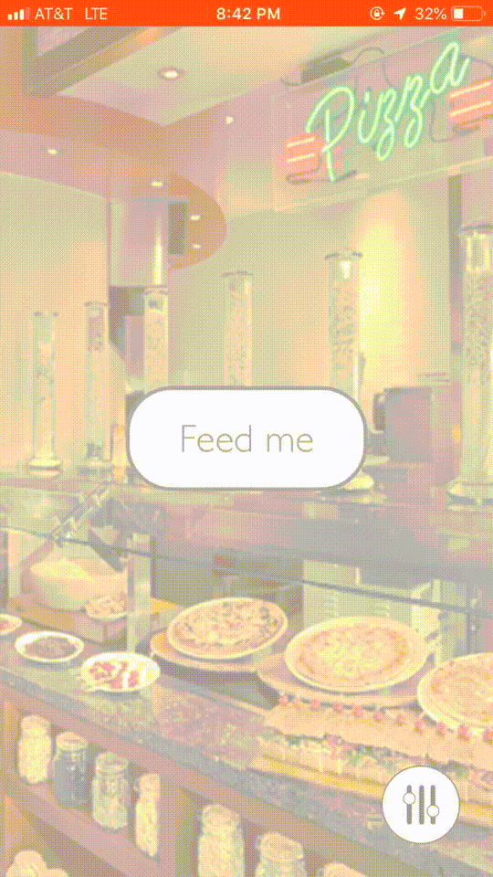

# foodie

foodie is an iOS application that provides one restaurant at random. 

You can select how far you want the distance to be: 

You can select from a list of cuisines:

You can click the "Feed Me" button to generate a restaurant of your choice:

And just like that, you have a restaurant that you can drive to within minutes. You don't have to waste time thinking about a restaurant that you want to go to or you don't have to stick with the same old options. Use foodie on your next meal out and you won't regret it!

Future features:
- Collect past restaurants
- Saving restaurants
